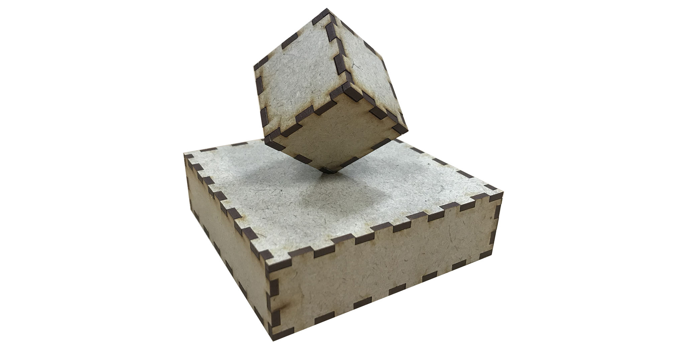

# OpenSCAD Laser Box

OpenSCAD laser box, *laserbox.scad*, is an OpenSCAD script that makes it easy to
quickly develop prototypes based on laser cut box jointed boxes.

The script contains explanatory comments which make it easy to get start.
Contributions are welcome, just make a pull request with a nice description and
commit messages. Comments and problems can be reported as issues on GitHub.